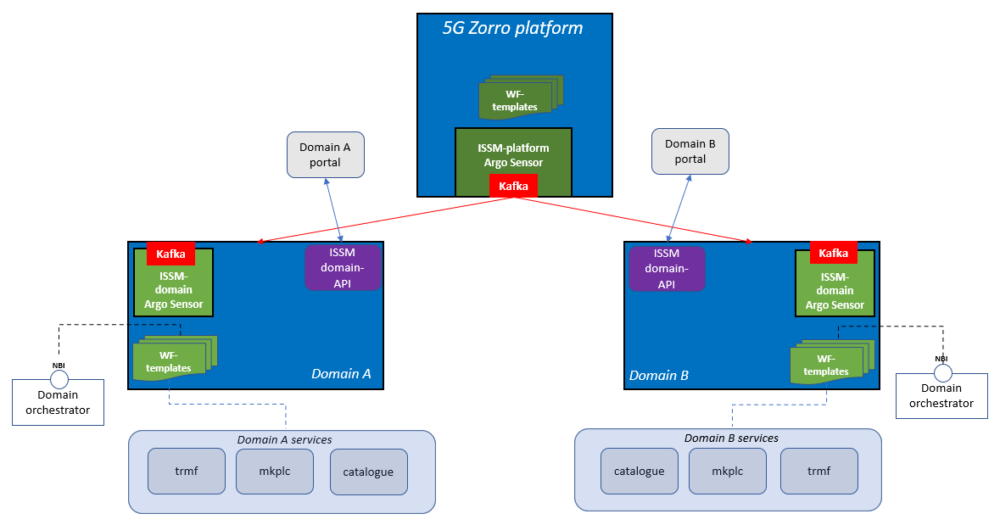

# ISSM

This is the __Intelligent slice and service manager__ component responsible for executing orchestration workflows in a context of a business transaction, such as extending a slice across a second domain in cooperation with the Network Slice and Service Orchestration.

## Pre-requisites

To install ISSM follow the installation guidelines per component following the below flow:
1. **Provision kubernetes cluster**. The guidelines are available [here](docs/kubernetes.md).
2. **Install kafka broker.** Follow the guidelines [here](docs/kafka.md).
3. **Install Datalake services**. Follow the guidelines [here](https://github.com/5GZORRO/datalake).
4. **Install SRSD**. Follow the guidelines [here](https://github.com/5GZORRO/Smart-Resource-and-Service-Discovery-application/tree/main/demo_June_21).
5. **Install ISSM-O**. Follow the guidelines [here](https://github.com/5GZORRO/issm-optimizer).

**Orchestration:**
For each mobile network operator (MNO), install either [NSSO](https://github.com/5GZORRO/nsso) or [ISSM-MEC-CNMP](https://github.com/5GZORRO/issm-mec-cnmp).

ISSM is comprised of a centralized component and a local instance running at the MNO premises




## Deploy ISSM centralized components

Log into 5GZorro platform kuberneters master

### Argo and Argo-events

Perform these [instructions](./docs/argo.md) to install Argo

### ISSM-API

Follow the guidelines [here](./api/README.md)

### Create Eventbus in issm namespace

```
kubectl create namespace issm
kubectl apply -n issm -f https://raw.githubusercontent.com/argoproj/argo-events/v1.1.0/examples/eventbus/native.yaml
```

### Create eventsource

Register an event source on platform issm kafka bus

Update kafka ip and port accordingly

```
export KAFKA_HOST=172.28.3.196
export KAFKA_PORT=9092
```

```
envsubst < deploy/kafka-sla-breach-event-source.yaml.template | kubectl apply -n issm -f -
```

### Add argo-event roles

Grant proper roles for issm sensor

```
kubectl apply -f deploy/install-v1.1.0.yaml
```

### Onboard SLA breach workflow

Create the sensor and flows

```
./apply-sla.sh
```

### ISSM-API service

Follow the guidelines [here](api/README.md) to install ISSM api service

## Deploy ISSM local instance

Follow the instructions in this order to deploy it in a given MNO. Repeat for every MNO you manage

Log into MNO kuberneters master

### Create MNO namespace

Assuming MNO is called `operator-a`

export

```
export MNO_NAME=operator-a
export MNO_NAMESPACE=domain-$MNO_NAME
```

**Note:** ensure to define namespace with `domain-` prefix

```
kubectl create namespace $MNO_NAMESPACE
```

### Add roles to MNO namespace

Run the below to add additional roles to `default` service account of the MNO namespace. These roles are used by argo workflow controller

```
kubectl apply -f deploy/role.yaml -n $MNO_NAMESPACE
```

### Add argo-event roles to MNO namespace

```
envsubst < deploy/install-v1.1.0-operator.yaml.template | kubectl apply -f -
```

### Create Eventbus in MNO namespace

```
kubectl apply -n $MNO_NAMESPACE -f https://raw.githubusercontent.com/argoproj/argo-events/v1.1.0/examples/eventbus/native.yaml
```

### Create MNO kafka event sources for ISSM

Register an event source on platform issm kafka bus

Update kafka ip and port accordingly

```
export KAFKA_HOST=172.28.3.196
export KAFKA_PORT=9092
```

```
export ISSM_DOMAIN_TOPIC=issm-in-$MNO_NAME
envsubst < deploy/kafka-event-source.yaml.template | kubectl apply -n $MNO_NAMESPACE -f -

export SLA_BREACH_DOMAIN_TOPIC=issm-breach-$MNO_NAME
envsubst < deploy/kafka-domain-sla-breach-event-source.yaml.template | kubectl apply -n $MNO_NAMESPACE -f -
```

Kafka topics are automatically created during the creation of the event sources


### Onboard orchestration workflow

First, customize the workflow with access information to the 5G Zorro services

Open `flows/issm-sensor.yaml`

Update access info for:

* ISSM kafka bus
* Datalake kafka bus
* Smart resource and service discovery

```
                arguments:
                  parameters:
                  - name: kafka_ip
                    value: 172.28.3.196
                  - name: kafka_port
                    value: 9092
                  - name: kafka_dl_ip
                    value: 172.28.3.196
                  - name: kafka_dl_port
                    value: 9092
                  - name: discovery_ip
                    value: 172.28.3.15
                  - name: discovery_port
                    value: 32000
```

then, onboard the flow

```
kubectl apply -f flows/issm-sensor.yaml -n $MNO_NAMESPACE
```

### Deploy common templates

Deploy common libraries according to the orchestration stack the mno supports

```
./apply-domain.sh NSSO
```

or

```
./apply-domain.sh MEC
```

## Trigger ISSM business flow

Follow the guidelines [here](./api/README.md#api)

then watch business flow progress with Argo GUI (`http://<kubernetes master ipaddress>:2746`) running on the participated MNOs

## Licensing

This 5GZORRO component is published under Apache 2.0 license. Please see the [LICENSE](./LICENSE) file for further details.