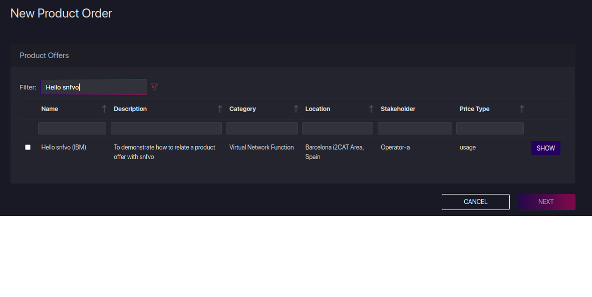
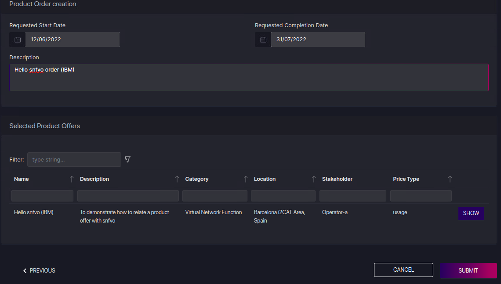
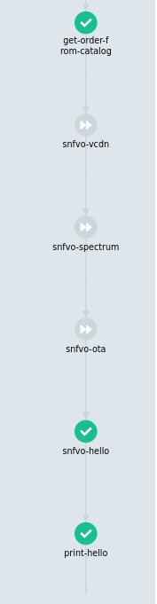

# snfvo

This folder contains the snfvos to be used by the project's use-cases.

Snfvo is an Argo WorkflowTemplate that contains the transaction logic for a specific product offer. It should be defined with `instantiate` and `scaleout` entry points depending on the transaction type being used

An snfvo is owned by a service owner (operator domain) and is related to a product offer by its name

**Note:** a product order must exist for this offer on behalf of the above service owner

## Run hello-world snfvo

Perform the below steps. We assume that the service owner is `operator-b`

### Create the order

Choose the product offer ("VNF", "Network Service" or "Slice") that your snfvo will manage

You (`operator-b`) must own the offer by creating an order; Log into [5GZorro portal](https://github.com/5GZORRO/GUI) and create a product order for it. Select the offer and fill in values accordingly





### Create snfvo flow

Write your snfvo template with the specific logic to manage your product offer. It should be defined with `instantiate` and `scaleout` entry points. Let's refer to [hello-world](./hello-snfvo.yaml) as an "hello" example

### Onboard snfvo

Use the cli to onboard it

**Note:** update `--issm_api_url` and `curl` urls accordingly

```
python3 ./cli.py --file ./hello-snfvo.yaml --service_owner operator-b --issm_api_url http://172.28.3.15:30080 --product_offer_id 72ce9b8b-532a-4064-a364-181fb4f5013e --snfvo_name "Hello snfvo (IBM)"
```

### List snfvo

Ensure your snfvo is listed

```
curl -H "Content-type: application/json" -X GET  http://172.28.3.15:30080/snfvo/operator-b

[
  {
    "product_offer_name": "72ce9b8b-532a-4064-a364-181fb4f5013e",
    "snfvo_name": "Hello snfvo (IBM)"
  },
  {
    "product_offer_id": "642d5460-53c1-4f97-9a50-702238f70ac6",
    "snfvo_name": "OTA demo eucnc core"
  },
  {
    "product_offer_id": "2ed69036-81ba-4e9a-a194-c066cea20847",
    "snfvo_name": "Slice Offer UC2"
  },
  {
    "product_offer_id": "72ce9b8b-532a-4064-a364-181fb4f5014a",
    "snfvo_name": "CDN Network Service (CDN+SAS)"
  }
]

```

### Create your ISSM intent file

ISSM input parameters are defines as intents. Refer [here](../api/intents/README.md) for more details. Update [hello-instantiate.json](./hello-instantiate.json) with the correct `order_id`

### Submit intent to ISSM

```
curl -H "Content-type: application/json" -X POST -d "@./hello-instantiate.json" http://172.28.3.15:30080/transactions/operator-b/instantiate

{
  "transaction_uuid": "dba63a5ce9e645f1986fc94501ad3cc4"
}
```

### Track progress

Select the transaction


It can be seen that `snfvo-72ce9b8b-532a-4064-a364-181fb4f5013e` properly called



### Remove hello snfvo

```
curl -H "Content-type: application/json" -X DELETE http://172.28.3.15:30080/snfvo/operator-b/72ce9b8b-532a-4064-a364-181fb4f5013e

{
  "OK": 200
}

```
